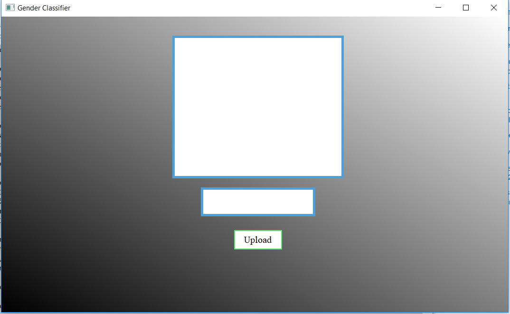
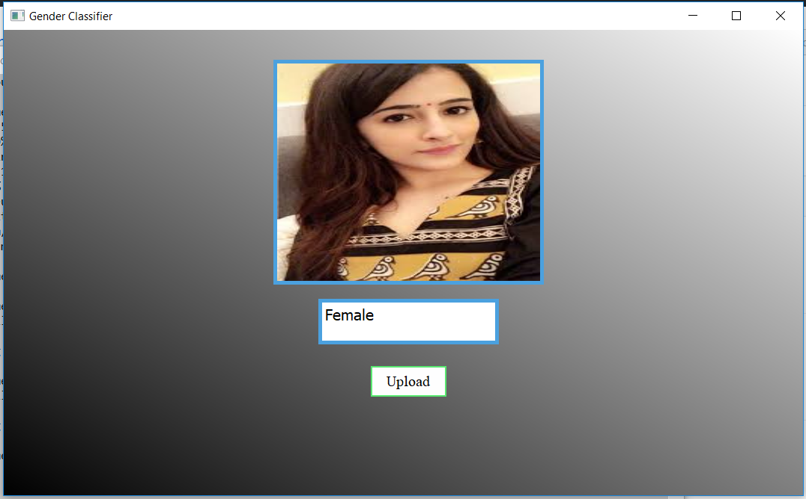
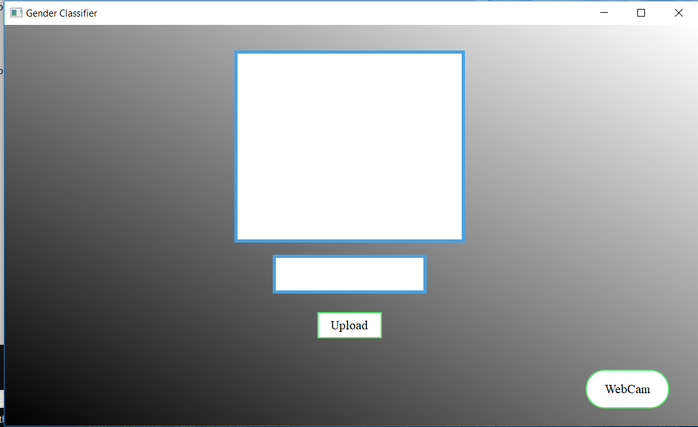
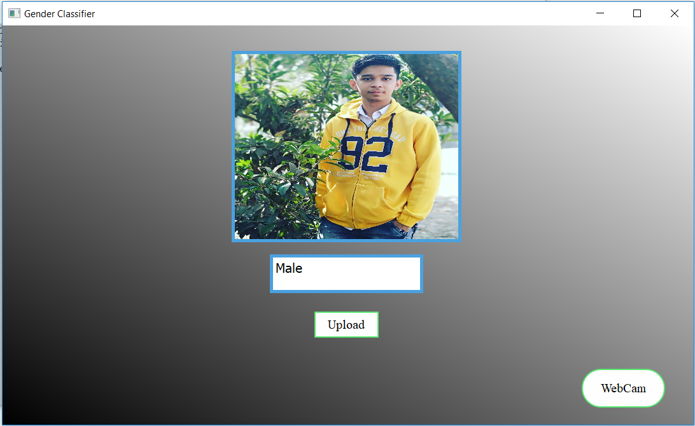
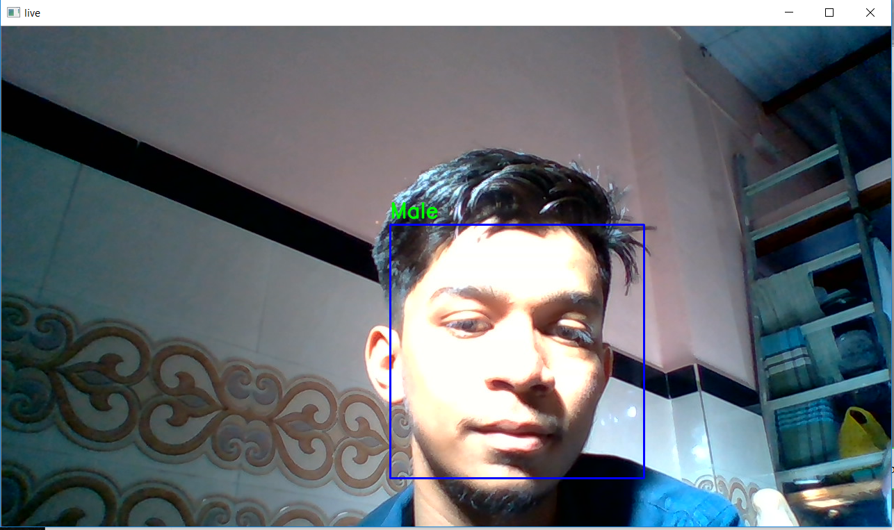
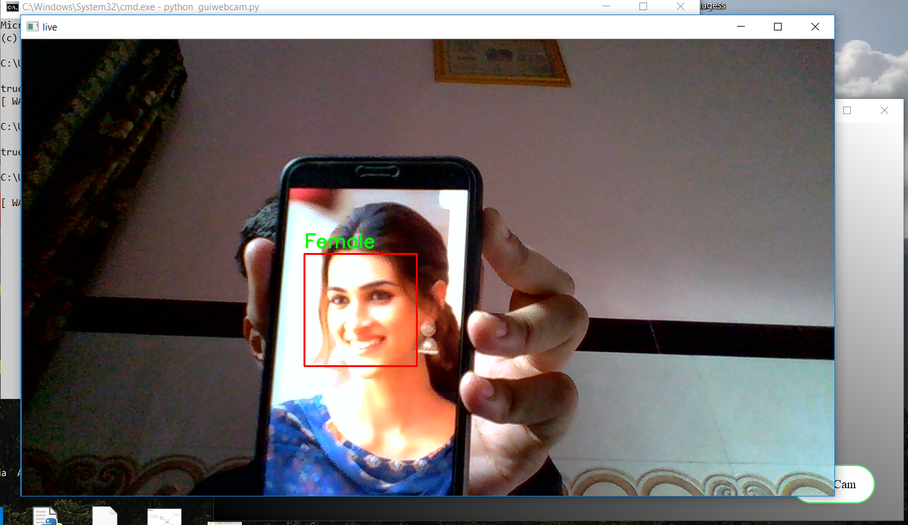

# gender_rec_opencv
# A Gender Classifier Project Created using opencv library python
Data Directory is in .gitignore

###### In src folder 
- classifier.py recognize gender via uploading photos which is based on terminal
u have to give file name in terminal.

- gui.py recognize gender via uploading photos which is based on gui

## - guiwebcam.py recognize gender via Webcam and uploading photo based on GUI :)

##### GUI overlook

##### Upload File detection

##### From Camera open From GUI i.e Male

##### From Camera open From GUI i.e female

